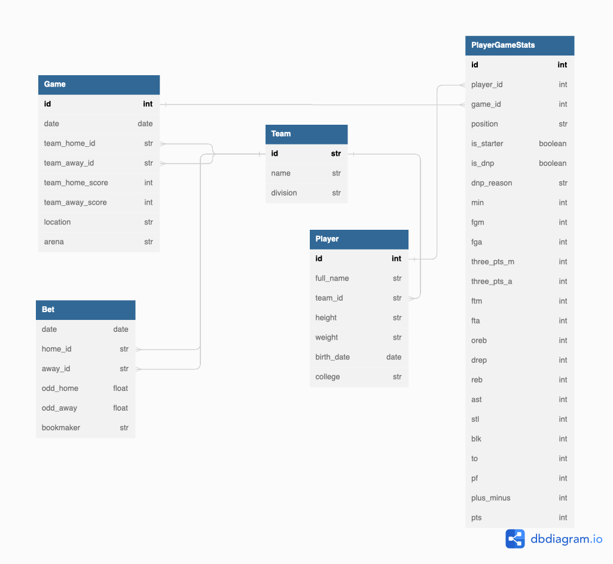

# Data mining project : NBA
 - [Benjamin Drai](https://www.linkedin.com/in/benjamin-d-838919127)
 - [Kevin Jerusalmi](https://www.linkedin.com/in/kevin-jerusalmi-151a74188)

## Introduction
The goal of this project is to create dashboards about NBA players' statistics during the season. 

This project is composed of three parts:
* Scrap the data from a website.
* Design and implement a database to store them.
* Run the code in production on AWS server.
* Create dashboards to analyse the data.

## Installation
To run the script, a `.env` file must be configured to set database information such as the host address, 
the user and password of the MySQL server and the name of the database.

The `.env` should look like this:
```
HOST_MYSQL=localhost
USER_MYSQL=root
PWD_MYSQL=root
DB_MYSQL=nba_db
```


## Data scraping
The website we decided to scrap to get our data is [ESPN](https://www.espn.com/nba).
Our scrapping is divided in two parts:
* Get all games id according to the dates we want to scrap from the [Scoreboard](https://www.espn.com/nba/scoreboard/_/date/20221109) page.
* Once we get the ids, we can go throw the [Box Score](https://www.espn.com/nba/boxscore/_/gameId/401468316) of each game and scrap the stat tables of each team.

To run the scrapper, we must execute the following command: ```python3 main.py```.

## Database Management
Data are stored into a MySQL database. 
The Entity Relationship Diagram of the NBA database is composed of 4 tables :  `Team`, `Player`, `Game` and `PlayerGameStats`.



Each game is associated to teams and players. For each game, players' statistics are stored into table `PlayerGameStats`.
### Team
This table is composed by:
* ID: string of two or three characters (ex: Los Angeles Lakers --> LAL).
* Name of the team.
* Division: the division the team plays.

### Player
This table contains all players informations:
* ID: ESPN ID associated to the player.
* Full Name.
* Team ID: the team where the player plays.
* Height.
* Weight.
* Birth Date.
* College: the college where the player studied. 

### Game
Table `Game` contains data about each game:
* ID: ESPN ID associated to the game.
* Team Home ID: ID of the team playing home.
* Team Away ID: ID of the team playing away.
* Team Home score.
* Team Away score.
* Location of the game.
* Arena.

### PlayerGameStats
Each line is the performance of a player during one game.
* ID: auto-incremented ID
* Player_ID
* Game_ID
* Position: the position where the player played during the game.
* Is Starter: Boolean decribing if a player was one of the five starter.
* Is DNP (Do Not Play).
* DNP Reason: the reason why a player did not play.
* All the stats (Minutes played, number of points...)